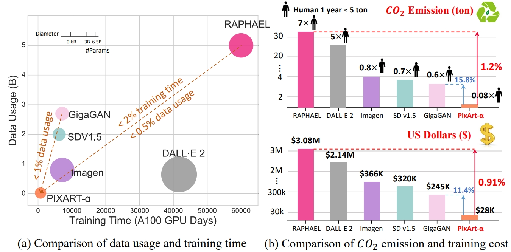
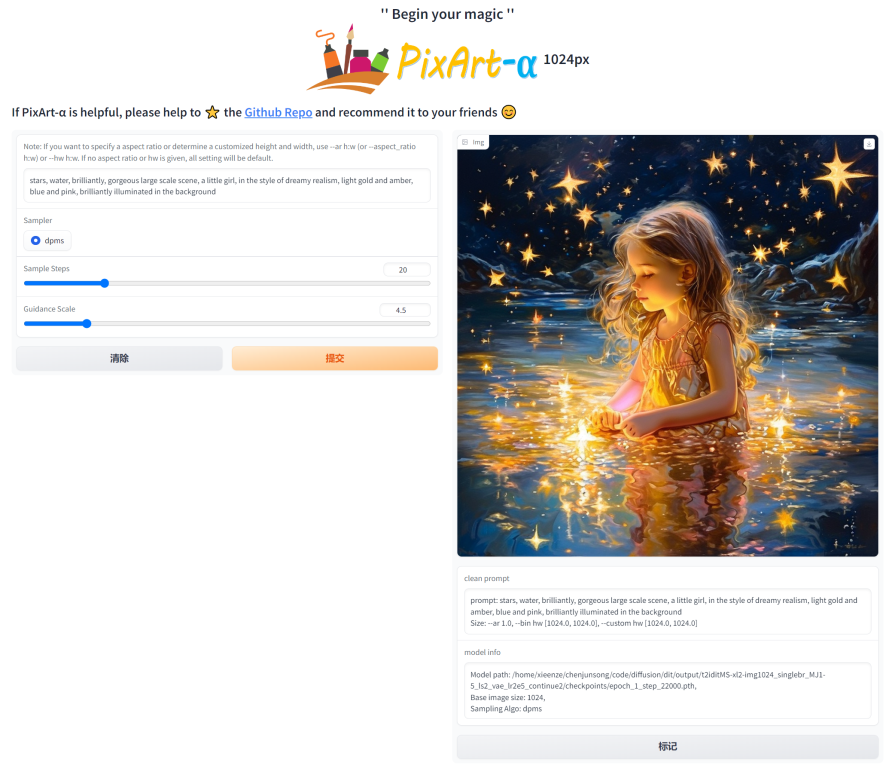
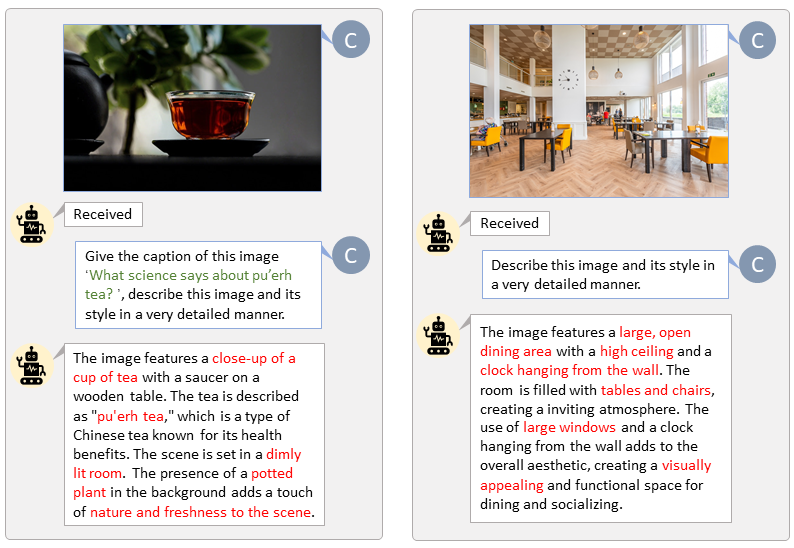

<p align="center">
  
</p>


### <div align="center">👉 PixArt-α: Fast Training of Diffusion Transformer for Photorealistic Text-to-Image Synthesis <div> 

<div align="center">
  <a href="https://pixart-alpha.github.io/"></a> &ensp;
  <a href="https://huggingface.co/docs/diffusers/main/en/api/pipelines/pixart"></a> &ensp;
  <a href="https://huggingface.co/spaces/PixArt-alpha/PixArt-alpha"></a> &ensp;
  <a href="https://huggingface.co/spaces/PixArt-alpha/PixArt-LCM"></a> &ensp;
  <a href="https://openxlab.org.cn/models/detail/PixArt-alpha/PixArt-alpha"></a> &ensp;
  <a href="https://colab.research.google.com/drive/1jZ5UZXk7tcpTfVwnX33dDuefNMcnW9ME?usp=sharing"></a> &ensp;
  <a href="https://arxiv.org/abs/2310.00426"></a> &ensp;
  <a href="https://discord.gg/hWT7caau"></a> &ensp;
</div>

---

This repo contains PyTorch model definitions, pre-trained weights and inference/sampling code for our paper exploring 
Fast training diffusion models with transformers. You can find more visualizations on our [project page](https://pixart-alpha.github.io/).

 **PixArt-α Community**: Join our PixArt-α discord channels <a href="https://discord.gg/hWT7caau" style="text-decoration:none;">
</a> for discussions. Coders are welcome to contribute.

> [**PixArt-α: Fast Training of Diffusion Transformer for Photorealistic Text-to-Image Synthesis**](https://pixart-alpha.github.io/)<br>
> [Junsong Chen*](https://lawrence-cj.github.io/), [Jincheng Yu*](https://lovesykun.cn/about.html), 
> [Chongjian Ge*](https://chongjiange.github.io/), [Lewei Yao*](https://scholar.google.com/citations?user=hqDyTg8AAAAJ&hl=zh-CN&oi=ao),
> [Enze Xie](https://xieenze.github.io/)&#8224;,
> [Yue Wu](https://yuewuhkust.github.io/), [Zhongdao Wang](https://zhongdao.github.io/), 
> [James Kwok](https://www.cse.ust.hk/~jamesk/), [Ping Luo](http://luoping.me/), 
> [Huchuan Lu](https://scholar.google.com/citations?hl=en&user=D3nE0agAAAAJ), 
> [Zhenguo Li](https://scholar.google.com/citations?user=XboZC1AAAAAJ)
> <br>Huawei Noah’s Ark Lab, Dalian University of Technology, HKU, HKUST<br>

---
## Breaking News 🔥🔥!!
- (🔥 New) Nov. 30, 2023. 💥 PixArt collaborates with [LCMs](https://github.com/luosiallen/latent-consistency-model) team to make the **fastest** [Training & Inference Text-to-Image Generation System](https://github.com/PixArt-alpha/PixArt-alpha).
Here, [Training code](train_scripts/train_pixart_lcm.py) & [Inference code](scripts/inference_lcm.py) & [Weights](https://huggingface.co/PixArt-alpha/PixArt-LCM-XL-2-1024-MS) & [Demo](https://huggingface.co/spaces/PixArt-alpha/PixArt-LCM) are all released, we hope users will enjoy them. 
Detailed **inference speed** and **code guidance** can be found in [docs](asset/docs/pixart_lcm.md). At the same time, we update the codebase for better user experience and fix some bugs in the newest version.

---
## 🚩 **New Features/Updates**
- ✅ Dec. 01, 2023. Add a [Notebook folder](./notebooks) to help users get started with PixArt quickly! Thanks to [@kopyl](https://github.com/kopyl) for his contribution!
- ✅ Nov. 27, 2023. 💥 **PixArt-α Community**: Join our PixArt-α discord channels <a href="https://discord.gg/hWT7caau" style="text-decoration:none;">
</a> for discussions. Coders are welcome to contribute.
- ✅ Nov. 21, 2023. 💥 [SA-Sovler](https://arxiv.org/abs/2309.05019) official code first release [here](asset/docs/sasolver.md).
- ✅ Nov. 19, 2023. Release `PixArt + Dreambooth` training scripts.
- ✅ Nov. 16, 2023. Diffusers support `random resolution` and `batch images` generation now. Besides, 
running `Pixart` in under 8GB GPU VRAM is available in 🧨 [diffusers](https://huggingface.co/docs/diffusers/main/en/api/pipelines/pixart).
- ✅ Nov. 10, 2023. Support DALL-E 3 Consistency Decoder in 🧨 diffusers.
- ✅ Nov. 06, 2023. Release pretrained weights with 🧨 diffusers integration, Hugging Face demo, and Google Colab example.
- ✅ Nov. 03, 2023. Release the LLaVA-captioning inference code.
- ✅ Oct. 27, 2023. Release the training & feature extraction code.
- ✅ Oct. 20, 2023. Collaborate with Hugging Face & Diffusers team to co-release the code and weights. (plz stay tuned.)
- ✅ Oct. 15, 2023. Release the inference code.

---

## 🐱 Abstract
<b>TL; DR: <font color="red">PixArt-α</font> is a Transformer-based T2I diffusion model whose image generation quality is competitive with state-of-the-art image generators (e.g., Imagen, SDXL, and even Midjourney), and the training speed markedly surpasses existing large-scale T2I models, e.g., PixArt-α only takes 10.8% of Stable Diffusion v1.5's training time (675 vs. 6,250 A100 GPU days).</b>

<details><summary>CLICK for the full abstract</summary>
The most advanced text-to-image (T2I) models require significant training costs (e.g., millions of GPU hours), 
seriously hindering the fundamental innovation for the AIGC community while increasing CO2 emissions. 
This paper introduces PixArt-α, a Transformer-based T2I diffusion model whose image generation quality is competitive with state-of-the-art image generators (e.g., Imagen, SDXL, and even Midjourney), 
reaching near-commercial application standards. Additionally, it supports high-resolution image synthesis up to 1024px resolution with low training cost. 
To achieve this goal, three core designs are proposed: 
(1) Training strategy decomposition: We devise three distinct training steps that separately optimize pixel dependency, text-image alignment, and image aesthetic quality; 
(2) Efficient T2I Transformer: We incorporate cross-attention modules into Diffusion Transformer (DiT) to inject text conditions and streamline the computation-intensive class-condition branch; 
(3) High-informative data: We emphasize the significance of concept density in text-image pairs and leverage a large Vision-Language model to auto-label dense pseudo-captions to assist text-image alignment learning. 
As a result, PixArt-α's training speed markedly surpasses existing large-scale T2I models, 
e.g., PixArt-α only takes 10.8% of Stable Diffusion v1.5's training time (675 vs. 6,250 A100 GPU days), 
saving nearly $300,000 ($26,000 vs. $320,000) and reducing 90% CO2 emissions. Moreover, compared with a larger SOTA model, RAPHAEL, 
our training cost is merely 1%. Extensive experiments demonstrate that PixArt-α excels in image quality, artistry, and semantic control. 
We hope PixArt-α will provide new insights to the AIGC community and startups to accelerate building their own high-quality yet low-cost generative models from scratch.
</details>

---


---

# 🔥🔥🔥 Why PixArt-α? 
## Training Efficiency
PixArt-α only takes 12% of Stable Diffusion v1.5's training time (753 vs. 6,250 A100 GPU days), saving nearly $300,000 ($28,000 vs. $320,000) and reducing 90% CO2 emissions. Moreover, compared with a larger SOTA model, RAPHAEL, our training cost is merely 1%.


| Method    | Type | #Params | #Images| FID-30K ↓        | A100 GPU days |
|-----------|------|---------|--------|------------------|---------------|
| DALL·E    | Diff | 12.0B   | 250M   | 27.50            |               |
| GLIDE     | Diff | 5.0B    | 250M   | 12.24            |               |
| LDM       | Diff | 1.4B    | 400M   | 12.64            |               |
| DALL·E 2  | Diff | 6.5B    | 650M   | 10.39            | 41,66         |
| SDv1.5    | Diff | 0.9B    | 2000M  | 9.62             | 6,250         |
| GigaGAN   | GAN  | 0.9B    | 2700M  | 9.09             | 4,783         |
| Imagen    | Diff | 3.0B    | 860M   | 7.27             | 7,132         |
| RAPHAEL   | Diff | 3.0B    | 5000M+ | 6.61             | 60,000        |
| PixArt-α  | Diff | 0.6B    | 25M    | 7.32 (zero-shot) | 753           |
| PixArt-α  | Diff | 0.6B    | 25M    | 5.51 (COCO FT)   | 753           |

## High-quality Generation from PixArt-α

- More samples
<div id="more-samples" style="display: flex; justify-content: center;">
  
  
</div>

- PixArt + [Dreambooth](https://dreambooth.github.io/)
<div id="dreambooth" style="display: flex; justify-content: center;">
  
  
</div>

- PixArt + [ControlNet](https://github.com/lllyasviel/ControlNet)
<div id="ControlNet" style="display: flex; justify-content: center;">
  
  
</div>

# 🔧 Dependencies and Installation

- Python >= 3.9 (Recommend to use [Anaconda](https://www.anaconda.com/download/#linux) or [Miniconda](https://docs.conda.io/en/latest/miniconda.html))
- [PyTorch >= 1.13.0+cu11.7](https://pytorch.org/)
```bash
conda create -n pixart python==3.9.0
conda activate pixart
cd path/to/pixart
pip install torch==2.0.0+cu117 torchvision==0.15.1+cu117 torchaudio==2.0.1 --index-url https://download.pytorch.org/whl/cu117
pip install -r requirements.txt
```

# ⏬ Download Models
All models will be automatically downloaded. You can also choose to download manually from this [url](https://huggingface.co/PixArt-alpha/PixArt-alpha).

| Model            | #Params  | url                                                                                                                                                                                             | Download in OpenXLab                           |
|:-----------------|:---------|:------------------------------------------------------------------------------------------------------------------------------------------------------------------------------------------------|:-----------------------------------------------|
| T5               | 4.3B     | [T5](https://huggingface.co/PixArt-alpha/PixArt-alpha/tree/main/t5-v1_1-xxl)                                                                                                                    | [T5](https://download.openxlab.org.cn/models/PixArt-alpha/PixArt-alpha/weight/t5-v1_1-xxl.zip)  |
| VAE              | 80M      | [VAE](https://huggingface.co/PixArt-alpha/PixArt-alpha/tree/main/sd-vae-ft-ema)                                                                                                                 | [VAE](https://download.openxlab.org.cn/models/PixArt-alpha/PixArt-alpha/weight/sd-vae-ft-ema.zip)   |
| PixArt-α-SAM-256 | 0.6B     | [256](about:blank)                                                                                                                                                                              | [256](about:blank)                          |
| PixArt-α-512     | 0.6B     | [PixArt-XL-2-512x512.pth](https://huggingface.co/PixArt-alpha/PixArt-alpha/resolve/main/PixArt-XL-2-512x512.pth) or [diffuser version](https://huggingface.co/PixArt-alpha/PixArt-XL-2-512x512) | [512](https://download.openxlab.org.cn/models/PixArt-alpha/PixArt-alpha/weight/PixArt-XL-2-512x512.pth)   |
| PixArt-α-1024    | 0.6B     | [PixArt-XL-2-1024-MS.pth](https://huggingface.co/PixArt-alpha/PixArt-alpha/resolve/main/PixArt-XL-2-1024-MS.pth) or [diffuser version](https://huggingface.co/PixArt-alpha/PixArt-XL-2-1024-MS) |[1024](https://download.openxlab.org.cn/models/PixArt-alpha/PixArt-alpha/weight/PixArt-XL-2-1024-MS.pth)  |

ALSO find all models in [OpenXLab_PixArt-alpha](https://openxlab.org.cn/models/detail/PixArt-alpha/PixArt-alpha)

# 🔥 How to Train
## 1. PixArt Training

First of all.

thanks to [@kopyl](https://github.com/kopyl), you can reproduce the full fine-tune training flow on [Pokemon dataset](https://huggingface.co/datasets/lambdalabs/pokemon-blip-captions) from HugginFace with notebooks:
1. Train with [notebooks/train.ipynb](https://github.com/PixArt-alpha/PixArt-alpha/blob/53dac066f60fe5fdbdde4f0360145ca96d4cc38c/notebooks/train.ipynb).
2. Convert to Diffusers with [notebooks/convert-checkpoint-to-diffusers.ipynb](https://github.com/PixArt-alpha/PixArt-alpha/blob/master/notebooks/convert-checkpoint-to-diffusers.ipynb).
3. Run the inference with converted checkpoint in step 2 with [notebooks/infer.ipynb](https://github.com/PixArt-alpha/PixArt-alpha/blob/master/notebooks/infer.ipynb).

Then, for more details.

Here we take SAM dataset training config as an example, but of course, you can also prepare your own dataset following this method.

You **ONLY** need to change the **config** file in [config](./configs/pixart_config) and **dataloader** in [dataset](./diffusion/data/datasets).
```bash
python -m torch.distributed.launch --nproc_per_node=2 --master_port=12345 train_scripts/train.py configs/pixart_config/PixArt_xl2_img256_SAM.py --work-dir output/train_SAM_256
```

The directory structure for SAM dataset is:
```
cd ./data

SA1B
├──images/  (images are saved here)
│  ├──sa_xxxxx.jpg
│  ├──sa_xxxxx.jpg
│  ├──......
├──captions/    (corresponding captions are saved here, same name as images)
│  ├──sa_xxxxx.txt
│  ├──sa_xxxxx.txt
├──partition/   (all image names are stored txt file where each line is a image name)
│  ├──part0.txt
│  ├──part1.txt
│  ├──......
├──caption_feature_wmask/   (run tools/extract_caption_feature.py to generate caption T5 features, same name as images except .npz extension)
│  ├──sa_xxxxx.npz
│  ├──sa_xxxxx.npz
│  ├──......
├──img_vae_feature/  (run tools/extract_img_vae_feature.py to generate image VAE features, same name as images except .npy extension)
│  ├──train_vae_256/
│  │  ├──noflip/
│  │  │  ├──sa_xxxxx.npy
│  │  │  ├──sa_xxxxx.npy
│  │  │  ├──......

```

**Here we prepare data_toy for better understanding**
```bash
cd ./data

git lfs install
git clone https://huggingface.co/datasets/PixArt-alpha/data_toy
```
Then, 
[Here](https://huggingface.co/datasets/PixArt-alpha/data_toy/blob/main/part0.txt) is an example of partition/part0.txt file.

---

Besides, for json file guided [training](https://github.com/PixArt-alpha/PixArt-alpha/blob/fe0cb78065d64c18ecd8955a04e4f29138d47946/configs/pixart_config/PixArt_xl2_img1024_internalms.py#L3C2-L3C2),
[here](https://huggingface.co/datasets/PixArt-alpha/data_toy/blob/main/data_info.json) is a toy json file for better understand.

---

## 2. PixArt + DreamBooth Training

Following the `Pixart + DreamBooth` [training guidance](asset/docs/pixart-dreambooth.md)

## 3. PixArt +LCM Training

Following the `PixArt + LCM` [training guidance](asset/docs/pixart_lcm.md)


# 💻 How to Test
Inference requires at least `23GB` of GPU memory using this repo, while `11GB and 8GB` using in 🧨 [diffusers](#using-in--diffusers).

Currently support:
- [x] [IDDPM](https://arxiv.org/abs/2102.09672)
- [x] [DPM-Solver](https://arxiv.org/abs/2206.00927)
- [x] [SA-Solver](https://arxiv.org/abs/2309.05019)
- [ ] [DPM-Solver-v3](https://arxiv.org/abs/2310.13268v2)

## 1. Quick start with [Gradio](https://www.gradio.app/guides/quickstart)

To get started, first install the required dependencies. Make sure you've downloaded the [models](https://huggingface.co/PixArt-alpha/PixArt-alpha) to the output/pretrained_models folder, and then run on your local machine:

```bash
DEMO_PORT=12345 python scripts/app.py
```

As an alternative, a sample [Dockerfile](Dockerfile) is provided to make a runtime container that starts the Gradio app.

```bash
docker build . -t pixart
docker run --gpus all -it -p 12345:12345 -v <path_to_models>:/workspace/output/pretrained_models pixart
```

Let's have a look at a simple example using the `http://your-server-ip:12345`.


## 2. Integration in diffusers
### 1). Using in 🧨 diffusers

Make sure you have the updated versions of the following libraries:

```bash
pip install -U transformers accelerate diffusers
```

And then:

```python
import torch
from diffusers import PixArtAlphaPipeline, ConsistencyDecoderVAE, AutoencoderKL

# You can replace the checkpoint id with "PixArt-alpha/PixArt-XL-2-512x512" too.
pipe = PixArtAlphaPipeline.from_pretrained("PixArt-alpha/PixArt-XL-2-1024-MS", torch_dtype=torch.float16, use_safetensors=True)

# If use DALL-E 3 Consistency Decoder
# pipe.vae = ConsistencyDecoderVAE.from_pretrained("openai/consistency-decoder", torch_dtype=torch.float16)

# If use SA-Solver sampler
# from diffusion.sa_solver_diffusers import SASolverScheduler
# pipe.scheduler = SASolverScheduler.from_config(pipe.scheduler.config, algorithm_type='data_prediction')

# Enable memory optimizations.
pipe.enable_model_cpu_offload()

prompt = "A small cactus with a happy face in the Sahara desert."
image = pipe(prompt).images[0]
```
Check out the [documentation](./asset/docs/sasolver.md) for more information abount SA-Solver Sampler.

This integration allows running the pipeline with a batch size of 4 under 11 GBs of GPU VRAM. 
Check out the [documentation](https://huggingface.co/docs/diffusers/main/en/api/pipelines/pixart) to learn more.

### 2). Running the `PixArtAlphaPipeline` in under 8GB GPU VRAM

GPU VRAM consumption under 8 GB is supported now, please refer to [documentation](asset/docs/pixart.md) for more information.

### 3). Gradio with diffusers (Faster)

To get started, first install the required dependencies, then run on your local machine:

```bash
# diffusers version
DEMO_PORT=12345 python scripts/app.py
```
Let's have a look at a simple example using the `http://your-server-ip:12345`.

You can also click [here](https://colab.research.google.com/drive/1jZ5UZXk7tcpTfVwnX33dDuefNMcnW9ME?usp=sharing) to have a free trial on Google Colab.

### 4). Convert .pth checkpoint into diffusers version

```bash
python tools/convert_pixart_alpha_to_diffusers.py --image_size your_img_size --orig_ckpt_path path/to/pth --dump_path path/to/diffusers --only_transformer=True
```


## 3. Online Demo [](https://huggingface.co/spaces/PixArt-alpha/PixArt-alpha) 


# ✏️ How to LLaVA captioning
Thanks to the code base of [LLaVA-Lightning-MPT](https://huggingface.co/liuhaotian/LLaVA-Lightning-MPT-7B-preview), 
we can caption the LAION and SAM dataset with the following launching code:
```bash
python tools/VLM_caption_lightning.py --output output/dir/ --data-root data/root/path --index path/to/data.json
```
We present auto-labeling with custom prompts for LAION (left) and SAM (right). The words highlighted in green represent the original caption in LAION, while those marked in red indicate the detailed captions labeled by LLaVA.



# ✏️ How to extract T5 and VAE features

Prepare T5 text feature and VAE image feature in advance will speed up the training process and save GPU memory.
```bash
python tools/extract_features.py
```

## 💪To-Do List

- [x] Inference code
- [x] Training code
- [x] T5 & VAE feature extraction code
- [x] LLaVA captioning code
- [x] Model zoo 
- [x] Diffusers version & Hugging Face demo
- [x] Google Colab example
- [x] DALLE3 VAE integration
- [x] Inference under 8GB GPU VRAM with diffusers
- [x] Dreambooth Training code
- [x] SA-Solver code
- [x] PixArt-α-LCM will release soon
- [ ] PixArt-α-LCM-LoRA will release soon
- [ ] SAM-LLaVA caption dataset
- [ ] ControlNet code


[//]: # (.mp4)


# 📖BibTeX
    @misc{chen2023pixartalpha,
          title={PixArt-$\alpha$: Fast Training of Diffusion Transformer for Photorealistic Text-to-Image Synthesis}, 
          author={Junsong Chen and Jincheng Yu and Chongjian Ge and Lewei Yao and Enze Xie and Yue Wu and Zhongdao Wang and James Kwok and Ping Luo and Huchuan Lu and Zhenguo Li},
          year={2023},
          eprint={2310.00426},
          archivePrefix={arXiv},
          primaryClass={cs.CV}
    }
    
# 🤗Acknowledgements
- Thanks to [Diffusers](https://github.com/huggingface/diffusers) for their wonderful technical support and awesome collaboration!
- Thanks to [Hugging Face](https://github.com/huggingface) for sponsoring the nicely demo!
- Thanks to [DiT](https://github.com/facebookresearch/DiT) for their wonderful work and codebase!

